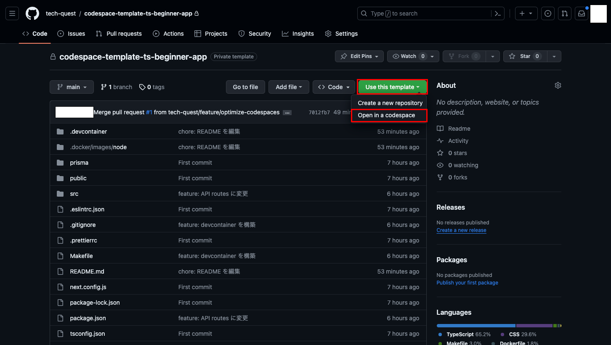
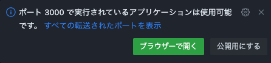

# 学習用教材: Next.js チュートリアル その① 〜 HTML を表示してみよう〜

普段皆さん見ている Web サイトは HTML (Hyper Text Markup Language) というルールで表現されています。<br>
レポートを作る際に文章に意味をもたせるのと同じで、サイト上に表示する文字や画像などに「見出し」などの意味を付与したり、「セクション (章)」としてグルーピングを行ったりすることができます。<br>
このような HTML で作成されたファイルを `.html` ファイルと呼びます。

この HTML ファイルを作成するのはもちろんのこと、<br>
見た目を装飾してデザインを適用したり、動きをつけたりして実際の画面を作成していく作業をフロントエンド開発と呼びます。

しかし近年では HTML ファイルを直接作成するような手法は少なくなっており、フレームワークと呼ばれる仕組みを使用して開発する「モダン開発」という手法が選択されることが多くなっています。<br>
そこで今回は近年様々な場所で利用されている Next.js というフレームワークを使用して画面を作成していきます。

詳しい使い方やフロントエンドに関する知識を身に着けていくことも今後は重要になってきますが、まずは手順に従って開発の片鱗を体験してみましょう！

## 動かし方

当アプリは Github の Codespaces 機能を使用して動作の確認や編集が行えるように設計されています。

### Codespaces とは

普段 Github にアクセスしているブラウザ上で開発が行えるサービスとなっています。  
ご自身で無料でのご利用に制限はありますが、ご自身の PC 上に開発環境を構築することなく  
アプリケーションの開発を体験することが可能となります。

詳細は下記をご参照ください。  
https://docs.github.com/ja/codespaces/overview

### Codespaces を使用してアプリを起動する手順

#### 1. 新規スペースを作成する

まずはじめに新規スペースを作成してエディタを立ち上げます。

以下画面を参考にし、当リポジトリの「Use this template」ボタンをクリックして「Open in a codespace」をクリックしてください。


※ 画像に表示されている画面は当リポジトリではありません

以下画面に切り替わり、開発環境が自動で構築されます。


※ 構築が完了するまで数分かかる場合があります。

#### 2. ターミナルでアプリの起動コマンドを実行する

1 でスペースの作成が完了すると、コードを編集するためのエディタが表示されます。

エディタ下部にあるターミナル画面に以下コマンドを入力してエンターキーで実行し、アプリケーションを起動してください。

```
npm run dev
```


#### 3. 起動したアプリをブラウザで確認する

2 でアプリの起動が完了すると、右下に以下のようなポップアップが表示されますので「ブラウザーで開く」をクリックしましょう。



上記が表示されない場合は以下の画像を参考にエディター下部の「ポート」タブから「3000」番のポートを探し、地球儀アイコンをクリックすることでも開くこともできます。


ブラウザで開いたら下記画面が表示されれば起動成功になります！


※ 画像に表示されている画面はアプリによって異なります
